---

## The thread connecting my work

I work at the intersection of **AI engineering, mathematical research, algorithms, and software engineering**.

My mathematical background shapes how I approach engineering problems: understand the structure, make assumptions explicit, choose a suitable model or method, implement it carefully, and evaluate what actually happened.

My current direction is **AI Engineering with strong mathematical and software-engineering foundations**, especially for systems involving retrieval, learning, optimization, adaptation, and decision-making.

### From problem to outcome

<table>
<tr>
<td align="center" width="20%"><strong>Problem</strong> Structure & constraints</td>
<td align="center" width="5%">→</td>
<td align="center" width="20%"><strong>Model</strong> Assumptions & representation</td>
<td align="center" width="5%">→</td>
<td align="center" width="20%"><strong>Algorithm / AI</strong> Method & implementation</td>
<td align="center" width="5%">→</td>
<td align="center" width="20%"><strong>System</strong> Reliable behavior</td>
<td align="center" width="5%">→</td>
<td align="center" width="20%"><strong>Outcome</strong> Measure & improve</td>
</tr>
</table>

## What I build

<table>
<tr>
<td width="50%" valign="top">

### AI Engineering

RAG systems, embeddings, information retrieval, hybrid search, reranking, grounded generation, citation verification, evaluation, and AI-backed services.

</td>
<td width="50%" valign="top">

### Mathematical AI

Mathematical modelling, optimization, numerical algorithms, and research-driven learning methods where problem structure informs computation.

</td>
</tr>
<tr>
<td width="50%" valign="top">

### Intelligent & Adaptive Systems

Systems that observe execution, learn from evidence, make decisions, adapt behavior, and evaluate the result through explicit feedback loops.

</td>
<td width="50%" valign="top">

### Software & Research Engineering

Architecture, APIs, backend and distributed systems, testing, reliability, reproducibility, experiments, benchmarks, and research implementations.

</td>
</tr>
</table>

## Selected evidence

<table>
<tr>
<td width="50%" valign="top">

### [Evidence-Grounded-RAG](https://github.com/peymanpro/Evidence-Grounded-RAG)

A research-oriented RAG system focused on **evidence retrieval, hybrid search, reranking, grounded generation, citation verification, and measurable evaluation**.

<code>AI Engineering</code> <code>RAG</code> <code>Information Retrieval</code>

</td>
<td width="50%" valign="top">

### [LNASF](https://github.com/peymanpro/LNASF)

A research-oriented framework exploring **learning-native adaptive software** through the loop:

**observe → learn → decide → adapt → evaluate**

<code>Research Software</code> <code>Adaptive Systems</code>

</td>
</tr>
<tr>
<td width="50%" valign="top">

### [Convex QP Solver](https://github.com/peymanpro/Convex-Quadratic-Programming-Solver)

A mathematical optimization implementation focused on **convex quadratic programming, numerical reasoning, correctness, and testing**.

<code>Optimization</code> <code>Numerical Algorithms</code>

</td>
<td width="50%" valign="top">

### [Event-Driven Metaheuristic Optimization](https://github.com/peymanpro/Event-Driven-Metaheuristic-Optimization)

An exploration connecting **metaheuristic optimization, event-driven architecture, and reproducible experimentation**.

<code>Optimization</code> <code>Algorithms</code>

</td>
</tr>
</table>

[Browse all repositories →](https://github.com/peymanpro?tab=repositories)

## Professional, Research & Online Identity

<table>
<tr>
<td width="33%" valign="top">

**Primary**

[Research](https://psalimi.ir/en/research)  
[Portfolio](https://peymanpro.github.io/portfolio/)  
[GitHub](https://github.com/peymanpro)  
[LinkedIn](https://www.linkedin.com/in/psalimi)

</td>
<td width="33%" valign="top">

**Scholarly**

[Google Scholar](https://scholar.google.com/citations?user=1By69aAAAAAJ&hl=en)  
[ORCID](https://orcid.org/0000-0002-8763-8394)  
[ResearchGate](https://www.researchgate.net/profile/Peyman-Salimi)  
[Academia](https://sut.academia.edu/PeymanSalimi)  
[zbMATH](https://zbmath.org/authors/?q=ai:salimi.peyman)  
[MaRDI](https://portal.mardi4nfdi.de/wiki/Item:Q251343)  
[Zenodo](https://doi.org/10.5281/zenodo.22142517)

</td>
<td width="34%" valign="top">

**Technical Community**

[DEV Community](https://dev.to/peymanpro)  
[Stack Overflow](https://stackoverflow.com/users/33163948)

 

Established identities and research-artifact records are listed here. Pending identity claims are intentionally omitted until independently verified.

</td>
</tr>
</table>

## Research background

My academic work is grounded in **mathematics**, with research spanning fixed-point and best-proximity-point theory, fuzzy analysis, differential and integral equations, and related mathematical modelling.

That background is not separate from my engineering work. It influences how I formulate problems, reason about algorithms, investigate learning methods, and turn research ideas into implementations that can be tested and evaluated.

## Engineering foundations

<table>
<tr>
<td width="50%" valign="top">

**Languages**

C# · Python · TypeScript · JavaScript

**AI / ML**

Machine Learning · Deep Learning · LLMs · RAG · Embeddings · Information Retrieval · Optimization

</td>
<td width="50%" valign="top">

**Backend & systems**

.NET · ASP.NET Core · APIs · PostgreSQL · Redis · Messaging · Distributed Systems

**Frontend**

React · Next.js · Angular · Blazor

</td>
</tr>
</table>

## How I work

> **Understand the problem before optimizing the implementation.**

I keep the important reasoning visible:

<table>
<tr>
<td align="center" width="14%"><strong>01</strong> Define</td>
<td align="center">→</td>
<td align="center" width="14%"><strong>02</strong> Baseline</td>
<td align="center">→</td>
<td align="center" width="14%"><strong>03</strong> Choose</td>
<td align="center">→</td>
<td align="center" width="14%"><strong>04</strong> Test</td>
<td align="center">→</td>
<td align="center" width="14%"><strong>05</strong> Measure</td>
<td align="center">→</td>
<td align="center" width="14%"><strong>06</strong> Analyze</td>
<td align="center">→</td>
<td align="center" width="14%"><strong>07</strong> Improve</td>
</tr>
</table>

The goal is not simply to make a system work, but to understand **why it works, where it fails, and how its behavior can be improved**.

## Current direction

**Mathematical Reasoning + Machine Learning + AI Systems + Optimization + Software Engineering**

I am particularly interested in AI systems that do more than generate output: systems that **retrieve evidence, reason over structured information, optimize decisions, learn from feedback, and remain inspectable and reliable**.

---

*research · engineering · intelligent systems*

